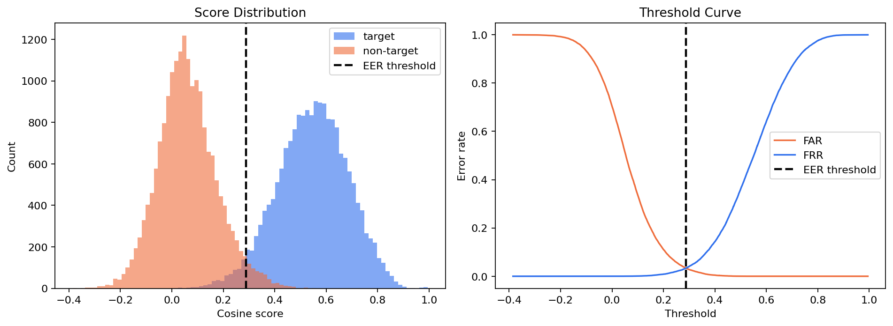
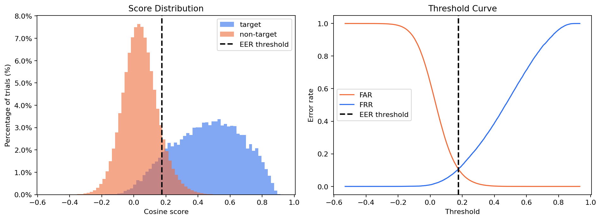
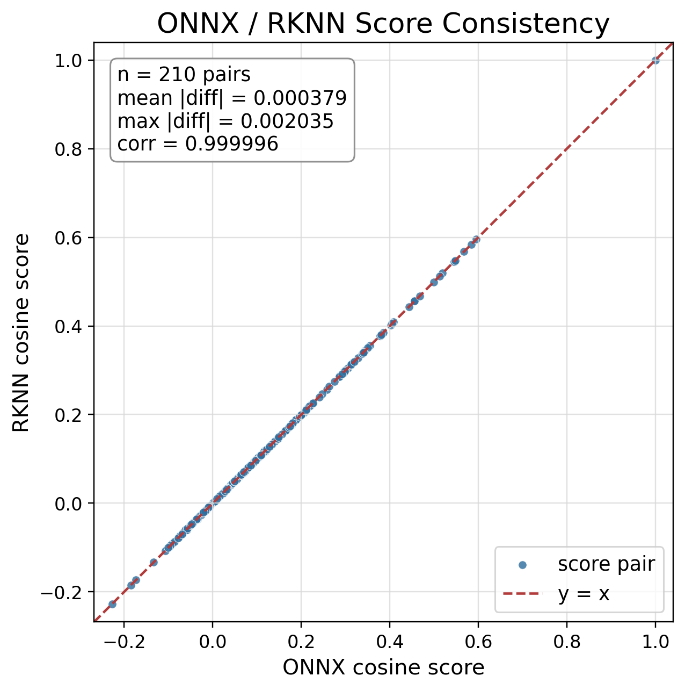
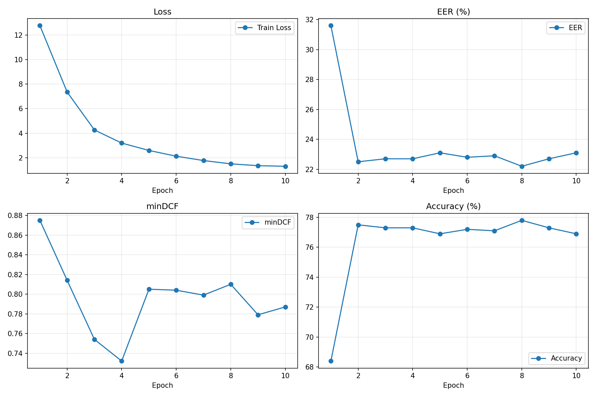
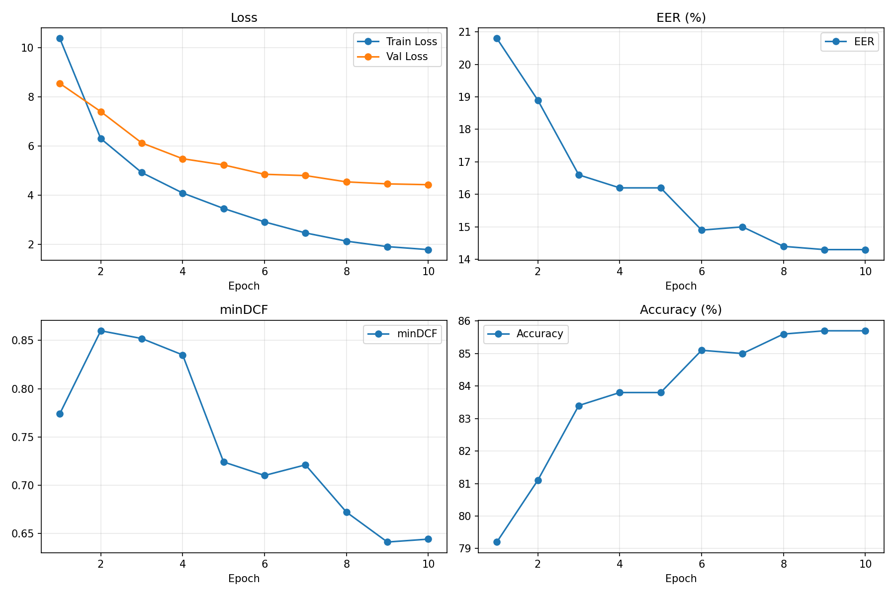

# Thesis Evidence Package - 2026-04-24

This file collects the project evidence that is suitable for thesis writing. It intentionally excludes the recent model-training retry experiments and keeps the thesis route focused on the stable system.

## 1. Recommended Thesis Route

The thesis should be written around this technical route:

1. Speaker embedding model training and evaluation.
2. ONNX export and RKNN deployment consistency verification.
3. PyQt5 GUI system with local and remote RKNN backends.
4. Remote RKNN board-side inference chain upgraded from single SSH runner to persistent HTTP service.
5. Optional PC-side passphrase recognition switch: final decision is `speaker_accept AND passphrase_match`.

Suggested wording:

> The system implements speaker identity verification as the main authentication factor. On this basis, an optional spoken-passphrase recognition module is added on the PC side, so that verification can require both voiceprint consistency and phrase consistency. The embedded RKNN path remains responsible for voiceprint inference, while the passphrase module is a GUI-side functional extension.

Do not write the passphrase feature as board-side ASR deployment yet. Current implementation is PC-side.

## 2. Core Experimental Results for Main Text

Use these as the main model comparison table.

| Group | Description | Checkpoint | EER | minDCF@0.01 | FRR@FAR<=1% | FRR@FAR<=0.1% |
|---|---|---|---:|---:|---:|---:|
| G1 | Old CN baseline | `resnet_v7_open_s2_best.pth` | 12.9703% | 0.647750 | 37.1839% | 55.6125% |
| G2 | Vox2 aac12 pretrain 15 epochs + CN-Celeb fine-tune | `resnet_v7_vox2ft_s1_latest.pth` | 10.6271% | 0.533754 | 28.0315% | 44.2692% |
| G3 | balanced_aug augmentation line | `resnet_v7_balanced_aug_s3_e10_best.pth` | 14.1094% | 0.672898 | 41.2391% | 58.6145% |

Recommended conclusion:

- G2 is the final main model for thesis.
- G1 is the old baseline.
- G3 is an ablation/negative comparison showing that the tested balanced augmentation line did not improve this task.
- Do not mix recent unfinished training attempts into this table.

Dataset name:

- First mention: `CN-Celeb.E, i.e. the official 200-identity CN-Celeb evaluation set`.
- Later mentions: `CN-Celeb.E`.

## 3. Optional Pretraining Evidence

This can be used as a short paragraph, not as the main result table.

| Stage | Checkpoint | Eval Set | EER | minDCF@0.01 | FRR@FAR<=1% | target mean | non-target mean |
|---|---|---|---:|---:|---:|---:|---:|
| Vox pretraining validation | `resnet_v7_vox2_aac12_pt_epoch_15.pth` | Vox1-O-cleaned | 3.3714% | 0.341536 | 9.1586% | 0.546305 | 0.060914 |

Suggested wording:

> The Vox pretraining stage was evaluated on Vox1-O-cleaned only to verify that the pretrained model learned discriminative speaker embeddings. It is not presented as a full SOTA comparison.

## 4. Deployment Consistency Evidence

### 4.1 PyTorch / ONNX Profile Verification

Source files:

- `artifacts/results/results_pytorch_profile_latest_calibration.json`
- `artifacts/results/results_onnx_profile_latest_calibration.json`
- `artifacts/results/results_pytorch_profile_latest.csv`
- `artifacts/results/results_onnx_profile_latest.csv`

Use this table in the deployment validation section.

| Backend | Checkpoint | Trials | EER | EER threshold | minDCF@0.01 | FAR<=1% threshold | FRR@FAR<=1% |
|---|---|---:|---:|---:|---:|---:|---:|
| PyTorch | `resnet_v7_vox2ft_s1_latest.pth` | 2000 | 7.3000% | 0.207305 | 0.468000 | 0.342072 | 24.3000% |
| ONNX | `resnet_v7_vox2ft_s1_latest_fixed.onnx` | 2000 | 7.3000% | 0.207273 | 0.468000 | 0.342024 | 24.3000% |

Suggested conclusion:

- PyTorch and ONNX have the same EER on the profile calibration set.
- Threshold difference is negligible.
- This supports correctness of model export before RKNN conversion.

### 4.2 ONNX / RKNN Score Consistency

Source files:

- `artifacts/results/onnx_scores_20.json`
- `artifacts/results/rknn_scores_20.json`
- `artifacts/thesis_assets/archive_figures/onnx_rknn_score_parity_clean.png`
- `artifacts/results/onnx_rknn_score_parity_20samples.png`
- `artifacts/results/onnx_rknn_parity_20samples.png`

Use these values:

| Item | Value |
|---|---:|
| num_pairs | 210 |
| mean_abs_diff | 0.0003789193451493269 |
| max_abs_diff | 0.002034764736890793 |
| corr | 0.9999958759290639 |
| RKNN toolkit/lite/runtime | 2.3.2 |

Recommended figure:

- Prefer `artifacts/thesis_assets/archive_figures/onnx_rknn_score_parity_clean.png` for the main text.
- Keep `artifacts/results/onnx_rknn_score_parity_20samples.png` and `artifacts/results/onnx_rknn_parity_20samples.png` as backup only; the older multi-panel figures are too busy for the thesis body.

## 5. Remote RKNN Operating Point Evidence

Source directory:

- `artifacts/results/remote_rknn_threshold_review_20260419_144135/`

Source files:

- `results.csv`
- `results_calibration.json`
- `report.md`

Summary:

| Item | Value |
|---|---:|
| total trials | 24 |
| same-speaker trials | 12 |
| different-speaker trials | 12 |
| current threshold | 0.342024 |
| current accuracy | 91.67% |
| current FAR | 8.33% |
| current FRR | 8.33% |
| EER threshold | 0.344299 |
| FAR<=1% recommended threshold | 0.425192 |
| selected-threshold accuracy | 95.83% |
| selected-threshold FAR | 0.00% |
| selected-threshold FRR | 8.33% |

How to write this:

- Treat it as a small-scale imported-phone-audio threshold review.
- Do not present it as a large benchmark.
- It supports that the current remote RKNN path has a usable operating point, and also shows why the stricter FAR-oriented threshold is safer.

## 6. Remote RKNN System Implementation Evidence

Recommended thesis wording:

> The remote RKNN path has been implemented as a board-side automatic verification chain. The PC GUI performs audio normalization and profile/history management. The board-side runner/service performs inference-time preprocessing, log-mel extraction, RKNN embedding, cosine scoring, threshold comparison, and returns structured verification results. The first implementation used SSH/SFTP with a single runner invocation; a later performance-oriented version introduced a persistent HTTP service to avoid repeated Python process startup and repeated RKNN runtime initialization.

Important boundaries:

- PC remains the source of truth for profile metadata and history.
- Board stores only one synchronized `active_profile.npy`.
- HTTP fallback is session-level, not per-request.
- The HTTP service is not claimed as a high-concurrency production service.

Useful implementation files:

| Area | Files |
|---|---|
| Board audio/RKNN chain | `utils/rknn_audio.py`, `rknn_inference.py` |
| SSH runner | `rknn_remote_runner.py` |
| HTTP service | `rknn_remote_http_server.py` |
| Deployment | `scripts/deploy_remote_rknn_board.py` |
| GUI board client | `gui/services/board_client.py` |
| GUI config/profile/history | `gui/services/config_store.py`, `gui/services/profile_store.py`, `gui/services/history_store.py` |
| GUI pages | `gui/pages/setup_page_pcfirst.py`, `gui/pages/verify_page.py`, `gui/main_window.py` |

Known HTTP health evidence from deployment:

| Item | Value |
|---|---|
| service status | ok |
| service framework | stdlib |
| python version | 3.10.5 |
| runtime_ready | true |
| model path | `/root/models/resnet_v7_vox2ft_s1_latest_fixed_rt160_nonorm_v232.rknn` |
| workdir | `/root/models/gui_jobs` |
| HTTP base URL | `http://192.168.50.2:8765` |

## 7. New Passphrase Recognition Feature

Current status:

- PC-side implementation is added.
- It uses SenseVoiceSmall through `funasr-onnx`.
- Model cache is redirected to `F:/speakerreg_artifacts/funasr_cache`.
- Final verification decision is:
  - `speaker_accept AND passphrase_match`
- It does not change the board protocol or RKNN model.

Implementation files:

| Area | Files |
|---|---|
| ASR service | `gui/services/asr_service.py` |
| Text matching | `gui/services/passphrase_match.py` |
| Config fields | `gui/services/config_store.py` |
| Setup controls | `gui/pages/setup_page_pcfirst.py` |
| Verify display | `gui/pages/verify_page.py` |
| Integration | `gui/main_window.py` |
| Dependency | `requirements_gui.txt` |

Suggested thesis placement:

- Chapter 4 system implementation: add a subsection such as `Optional spoken-passphrase verification`.
- Chapter 5 validation: include a functional test table only if manual tests are available.
- Appendix: list the ASR-related modules and configuration fields.

Do not claim:

- board-side ASR inference
- RKNN/NPU acceleration for ASR
- large-scale ASR accuracy benchmark

Suggested wording:

> To improve the system's resistance to replay or non-cooperative impostor attempts, the GUI adds an optional passphrase verification switch. When enabled, the normalized verification audio is also sent to a PC-side ASR module. The system accepts only when the speaker verification result is positive and the recognized text matches the configured passphrase.

## 8. Available Images

| Image | Suggested Use | Decision |
|---|---|---|
| `artifacts/thesis_assets/archive_figures/vox_pretrain_epoch15_vox1_o_cleaned_distribution.png` | Vox pretraining stage score distribution on Vox1-O-cleaned | Use as optional pretraining-validation figure. Better than the generic `plots` figures. |
| `artifacts/thesis_assets/archive_figures/vox2ft_s1_latest_cn200_distribution.png` | Final G2 model score distribution on CN-Celeb.E/CN200 | Use in main experiment section if one score-distribution figure is needed. |
| `artifacts/thesis_assets/archive_figures/onnx_rknn_score_parity_clean.png` | Main deployment consistency figure | Use in main text. It is cleaner than the older multi-panel parity figures. |
| `artifacts/results/onnx_rknn_score_parity_20samples.png` | Older deployment consistency figure | Backup only. Too busy for main text. |
| `artifacts/results/onnx_rknn_parity_20samples.png` | Appendix-level RKNN/ONNX embedding detail | Backup only. Too technical for main text. |
| `artifacts/thesis_assets/archive_figures/vox2ft_s1_training_curves_optional.png` | G2 fine-tuning training curve | Internal reference only. Do not use in the thesis body because the archived per-epoch records are incomplete. |
| `artifacts/thesis_assets/archive_figures/balanced_aug_s3_e10_training_curves_optional.png` | G3 negative comparison training curve | Internal reference only. Do not use in the thesis body because not every epoch was recorded. |
| `plots/resnet_v7_full_eval_refresh.png` | Score distribution / threshold curve | Replace with the archived CN200/Vox1 distribution images above. Current labels are generic and dataset/model are not shown. |
| `plots/resnet_v7_full_eval.png` | Duplicate of refresh plot | Do not use both. Keep only the refreshed/regenerated one. |
| `plots/eval_sample.png` | Small demonstration distribution | Do not use in main thesis; sample size looks too small. |

Images still worth adding:

1. System architecture figure: PC GUI, local backends, remote HTTP board, profile/history stores.
2. Remote RKNN sequence figure: normalize WAV -> upload -> board preprocess/RKNN -> score/decision -> GUI.
3. Optional passphrase flow: speaker verification result AND ASR text match.
4. GUI screenshots: setup page, enrollment/profile page, verification page with passphrase enabled.

## 9. Data Consolidation Advice

Consolidate results into three paper-facing tables:

1. Model performance table:
   - G1/G2/G3 only.
   - Dataset: CN-Celeb.E.
2. Deployment consistency table:
   - PyTorch vs ONNX.
   - ONNX vs RKNN score consistency.
3. System validation table:
   - remote RKNN threshold review.
   - HTTP service health.
   - optional passphrase functional cases if collected.

Keep these separate:

- Vox1-O-cleaned pretraining validation.
- CN-Celeb.E final model comparison.
- Imported-phone-audio threshold review.
- Passphrase ASR functional validation.

Do not put them into one mixed "accuracy" table, because they measure different tasks.

## 10. What Should Be Changed in the Thesis Draft

Content changes:

1. Make G2 the final model and explain why G3 is not selected.
2. Add a deployment validation section with PyTorch/ONNX/RKNN consistency.
3. Add a remote RKNN implementation section that distinguishes SSH runner v1 and HTTP daemon v2.
4. Add a PC-side passphrase verification subsection, clearly marked as optional.
5. Avoid claiming the ASR module is deployed on the board.

Table changes:

1. Replace scattered metric paragraphs with one clean G1/G2/G3 model table.
2. Add one deployment consistency table.
3. Add one small remote threshold review table.
4. If passphrase manual tests are collected, add a small functional test table with 4 cases:
   - same speaker + correct phrase
   - same speaker + wrong phrase
   - different speaker + correct phrase
   - different speaker + wrong phrase

Figure changes:

1. Use one ONNX/RKNN score parity figure in the main text.
2. Regenerate the score distribution figure with final model/dataset labels if it is used.
3. Add a system architecture diagram; this will make the thesis route clearer than adding more metric plots.

## 11. Items Not Recommended for Main Thesis

Do not use these as main thesis evidence:

- Recent unfinished model-training attempts.
- Score normalization experiments, unless written as a short "not adopted" appendix note.
- `plots/eval_sample.png` as a serious evaluation figure.
- Board-side ASR claims.
- Real-time/high-concurrency service claims for the HTTP daemon.

## 12. Archive Scan - 2026-04-24

Archives checked without extracting to C drive:

- `pullback_core.tar.gz`
- `m025_ft_bundle.tar.gz`
- `today_2026-04-16.tar.gz`
- `pullback_research_full.tar.gz`

Temporary scan/extraction directory:

- `F:/temp/speakerreg_archive_scan/`

Useful archived images copied into the repo:

| Copied Asset | Original Archive | Why Useful |
|---|---|---|
| `artifacts/thesis_assets/archive_figures/vox_pretrain_epoch15_vox1_o_cleaned_distribution.png` | `today_2026-04-16.tar.gz` | Shows the Vox-pretrained model separating target and non-target Vox1-O-cleaned trials. |
| `artifacts/thesis_assets/archive_figures/vox2ft_s1_latest_cn200_distribution.png` | `today_2026-04-16.tar.gz` | Shows the final Vox2+CN fine-tuned model separating target and non-target CN200/CN-Celeb.E trials. |
| `artifacts/thesis_assets/archive_figures/vox2ft_s1_training_curves_optional.png` | `today_2026-04-16.tar.gz` | Internal reference only. Do not use in the thesis body because the archived per-epoch records are incomplete. |
| `artifacts/thesis_assets/archive_figures/balanced_aug_s3_e10_training_curves_optional.png` | `pullback_research_full.tar.gz` | Internal reference only. Do not use in the thesis body because not every epoch was recorded. |

Markdown preview links from this `docs/` file:

Archived Vox1-O-cleaned CSV metrics recalculated from score files:

| Source CSV | EER | minDCF@0.01 | FRR@FAR<=1% | target mean | non-target mean |
|---|---:|---:|---:|---:|---:|
| `resnet_v7_vox2_aac12_pt_epoch_15_vox1_o_cleaned_scores.csv` | 3.3714% | 0.341536 | 9.1586% | 0.546305 | 0.060914 |
| `resnet_v7_vox2_aac12_pt_m025_ft_epoch_5_vox1_o_cleaned_scores.csv` | 3.3129% | 0.347875 | 9.0575% | 0.544919 | 0.051431 |
| `resnet_v7_vox2_aac12_pt_m025_ft_epoch_10_vox1_o_cleaned_scores.csv` | 3.3501% | 0.342336 | 9.2703% | 0.549331 | 0.059415 |

Archived CN-Celeb.E full-trial JSON evidence:

| Checkpoint | full-trial EER | minDCF@0.01 | FRR@FAR<=1% | FRR@FAR<=0.1% | target mean | non-target mean |
|---|---:|---:|---:|---:|---:|---:|
| `resnet_v7_vox2ft_s1_latest.pth` | 10.6271% | 0.533754 | 28.0315% | 44.2692% | 0.458983 | 0.040479 |
| `resnet_v7_vox2ft_s1_epoch_10.pth` | 10.6336% | 0.531426 | 28.2794% | 44.1904% | 0.457401 | 0.037111 |

Decision:

- Use the archived distribution images for thesis figures.
- Keep `plots/resnet_v7_full_eval_refresh.png` out of the main text unless it is regenerated with explicit model/dataset labels.
- Do not promote the `m025` margin fine-tune line into the main thesis result table. It is useful historical evidence but not the selected thesis route.
